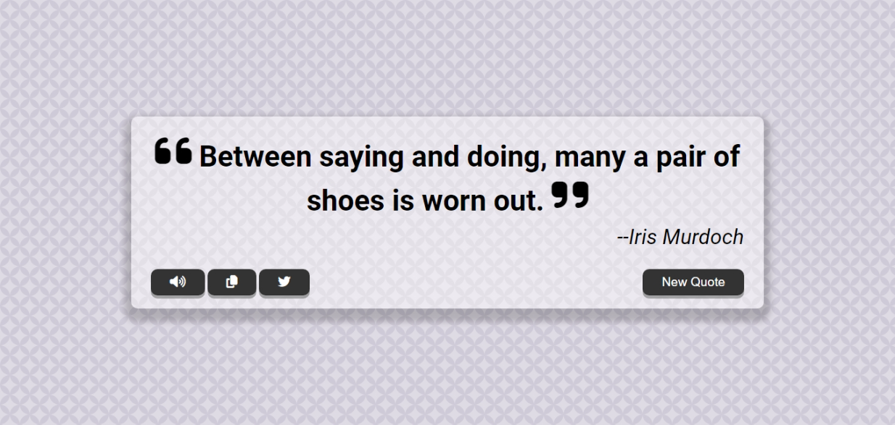

# Random Quote Generator

## Description

This is a simple random quote generator project with some nice functionality and features, like the ability to copy and tweet out a quote on Twitter. It's also a mobile responsive.

## Demo

You can try it out [here](https://eliasdewa14.github.io/random-quote-generator/)

## How was it built?

* This was built using HTML, CSS, and vanilla JavaScript.
* A [Random Quote API](http://api.quotable.io/random) and a [Web Search API](https://developer.mozilla.org/en-US/docs/Web/API/SpeechSynthesisUtterance) were used

## How to use

* Clone from Github
* Make any changes that you like
* Open `index.html` and try it out

## Contributing

Pull requests are welcome. For major changes, please open an issue first
to discuss what you would like to change.

## License

[MIT](https://choosealicense.com/licenses/mit/)